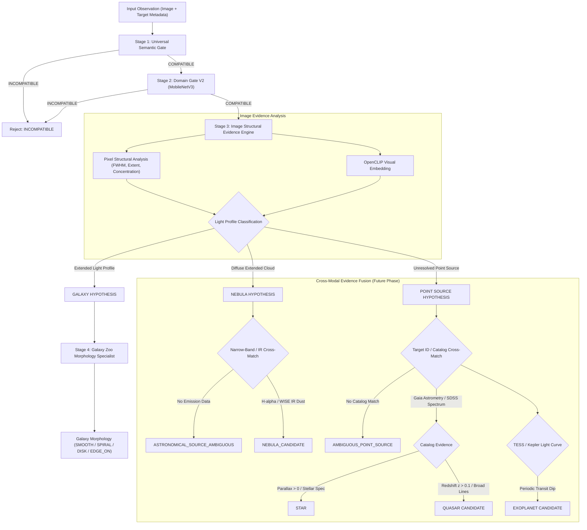

# ASTRA — Complete Object Identification Data & Architecture Audit

## 1. Current ASTRA Object Pipeline
The existing production ASTRA inference pipeline executes a multi-stage sequential processing workflow:

1. **Stage 1: Universal Semantic Gate** (`UniversalSemanticGate` in `ml/src/semantic_gate.py`)
   - Uses an OpenCLIP ViT-B/32 prompt family ensemble to measure visual similarity between input images and astronomical vs non-astronomical reference prompt sets.
   - Output: `SEMANTIC_COMPATIBLE`, `SEMANTIC_UNCERTAIN`, or `SEMANTIC_INCOMPATIBLE`.

2. **Stage 2: Domain Gate V2** (`DomainGateV2` in `ml/src/domain_gate_v2.py`)
   - MobileNetV3-Small binary classification model trained on 6,483 images (1,983 astronomical, 1,500 non-astronomical, 1,000 hard positives, 1,500 hard negatives).
   - Output: `COMPATIBLE` or `INCOMPATIBLE`.

3. **Stage 3: Evidence-First Object Router V2** (`ObjectIdentificationService` in `ml/src/object_identification.py`)
   - Combines 10 pure image-derived pixel structural metrics (`analyze_point_source_structure` in `ml/src/point_source_analysis.py`) with an OpenCLIP zero-shot prompt ensemble (5 balanced prompts per candidate object class).
   - Evaluates object structural sufficiency (FWHM, extent, radial concentration, spatial dispersion, diffuse emission score, point source score).
   - Output: `GALAXY`, `AMBIGUOUS_POINT_SOURCE`, `NEBULA_CANDIDATE`, `PLANETARY_CANDIDATE`, `ASTRONOMICAL_SOURCE_AMBIGUOUS`, `UNKNOWN`, or `INCOMPATIBLE`.

4. **Stage 4: Conditional Galaxy Zoo Specialist** (`GalaxyZooTriageEngine` in `ml/src/triage.py`)
   - ResNet34 fine-tuned morphology model.
   - **Strictly Conditional Execution**: Invoked **only** when Stage 3 independently establishes `predicted_object_type == "GALAXY"`.
   - Output: Morphology classification (`SMOOTH`, `FEATURED_DISK`, `EDGE_ON`, `SPIRAL`) and vote fractions.

5. **Stage 5: Anomaly & Triage Scoring Engine** (`GalaxyZooAnomalyEngine` in `ml/src/triage.py`)
   - Computes Novelty ($N$), Uncertainty ($U$), and Oddity ($O$).
   - Canonical Triage Formula: $T = 0.35 N + 0.35 U + 0.30 O$.

---

## 2. Current Failure Modes & Audit Findings
- **Zero-Shot CLIP Prompt Instability**: Single-band optical cutouts of extended galaxies with bright central galactic bulges often trigger OpenCLIP `top_class = "STAR"` because zero-shot text embeddings match the point-like nucleus. Conversely, dense star fields with background sky glow occasionally trigger `top_class = "GALAXY"`.
- **Inseparability of Unresolved Point Sources**: Single-band optical cutout imaging alone **cannot** visually separate a foreground star from an active galactic nucleus / distant quasar. Without spectroscopic redshift ($z$), astrometric proper motion ($\mu$), or multi-band photometry ($u, g, r, i, z, W1, W2$), zero-shot CLIP classification between `STAR` and `QUASAR` is scientifically uncalibrated.
- **Nebula Over-Classification Hazard**: Diffuse emission measurements alone ($extent\_px > 100, concentration < 0.40$) can occur in low-surface-brightness galaxy halos, galactic cirrus, or imaging artifacts. High-confidence `NEBULA` identification requires narrow-band emission line data ($H\alpha, [O III]$) or infrared dust maps.
- **Absence of Multi-Class Supervised Models**: The existing trained model weights (`ml/models/`) contain binary domain gates (`domain_gate_v2_mobilenetv3.pt`) and Galaxy Zoo morphology classifiers (`galaxy_zoo_resnet34.pt`). There is **no** supervised model trained on multi-class astronomical objects (`GALAXY`, `STAR`, `QUASAR`, `NEBULA`).

---

## 3. Complete Dataset Inventory

| Dataset Name | Path / Location | File Count | Size | Format | Primary Contents |
| :--- | :--- | :--- | :--- | :--- | :--- |
| **Galaxy Zoo 2 Raw Catalog** | `ml/data/raw/galaxy_zoo/merged_zoo_data.csv.gz` | 1 table | 51.3 MB | CSV (Gzip) | 243,500 SDSS objects (`dr7objid`, `ra`, `dec`, vote counts, debiased fractions) |
| **Galaxy Zoo 2 Mapping** | `ml/data/raw/galaxy_zoo/gz2_filename_mapping.csv` | 1 table | 12.6 MB | CSV | 245,609 ID-to-filename mappings (`objid`, `asset_id`) |
| **Galaxy Zoo Processed Images** | `ml/data/processed/galaxy_zoo/images/` | 10,000 files | ~115 MB | JPEG (424x424 RGB) | SDSS DR7 Galaxy Cutouts |
| **Galaxy Zoo Processed Manifest** | `ml/data/processed/galaxy_zoo/manifest.csv` | 1 table | 1.8 MB | CSV | 10,000 images with `dr7objid`, `ra`, `dec`, `gz2class`, debiased fractions |
| **Scientific Target Splits** | `ml/data/splits/subset_10k_scientific_targets.csv` | 1 table | 1.5 MB | CSV | 10,000 galaxy subset split into TRAIN/VAL/TEST with 4-class targets |
| **Domain Gate Dataset V1** | `ml/data/domain_gate/` | 3,658 files | ~45 MB | JPEG (RGB) + CSV | 1,798 astronomical cutouts, 1,800 non-astronomical, 60 ambiguous |
| **Domain Gate Dataset V2** | `ml/data/domain_gate_v2/` | 6,483 files | ~85 MB | JPEG (RGB) + CSV | 1,983 astronomical, 1,500 non-astronomical, 1,000 hard pos, 1,500 hard neg |
| **Adversarial Test Suites** | `ml/data/domain_gate/adversarial_positive/` | 120 files | ~3.5 MB | JPEG (RGB) | 15 images per category across 8 astronomical sub-types |
| **Observation Library** | `ml/data/library/observation_library.csv` | 2,000 rows | 0.9 MB | CSV + JSON | 2,000 synthetic/curated observation records (`LIB-000001` to `LIB-002000`) |

---

## 4. STAR Data
- **Labeled Star Image Cutouts**: **0 dedicated supervised star image cutouts** in `ml/data/`. Only 15 adversarial test images (`adv_pos_stellar_fields_*.jpg`) and 15 crowded field images exist in test sets.
- **Star Catalog Metadata**: `merged_zoo_data.csv.gz` contains `t01_smooth_or_features_a03_star_or_artifact_count` and `fraction` for 243,500 SDSS objects (objects where citizen scientists voted "star or artifact").
- **Missing Star Evidence**:
  - No Gaia DR3 astrometric data (parallax $\varpi$, proper motion $\mu_{\alpha}^*, \mu_{\delta}$).
  - No SDSS stellar spectrographic data (log g, $T_{eff}$, $[Fe/H]$).
  - No multi-band stellar photometry ($u, g, r, i, z, J, H, K_s$).
  - No stellar spectral type labels ($O, B, A, F, G, K, M$, White Dwarf, Red Giant).

---

## 5. GALAXY Data
- **Image Count**: 10,000 high-resolution SDSS galaxy cutouts (`ml/data/processed/galaxy_zoo/images/`, 424x424 pixels, RGB).
- **Catalog Metadata**: 243,500 objects with full debiased vote fractions in `merged_zoo_data.csv.gz`.
- **Morphology Labels**: Multi-class morphology targets (`SMOOTH`, `FEATURED_DISK`, `EDGE_ON`, `SPIRAL`).
- **Data Quality & Sufficiency**: **Abundant and production-ready**. Fully supports supervised galaxy morphology classification, anomaly detection, and out-of-distribution evaluation.

---

## 6. QUASAR Data
- **Labeled Quasar Image Cutouts**: **0 dedicated quasar image cutouts**. Only 15 survey cutouts (`adv_pos_survey_cutouts_*.jpg`) exist as positive domain gate test samples.
- **Quasar Catalogs / Metadata**: **0 quasar catalog tables** (no SDSS DR16Q, no MILLIQUAS, no SIMBAD AGN tables).
- **Missing Quasar Evidence**:
  - Spectroscopic redshift ($z$).
  - Broad emission line measurements ($Mg II \lambda 2798$, $C IV \lambda 1549$, $H\alpha$).
  - Multi-band optical/infrared colors ($u-g, g-r, r-i, i-z, W1-W2$).
  - X-ray and radio flux ratios ($F_X / F_{opt}$, $F_R / F_{opt}$).

---

## 7. NEBULA Data
- **Labeled Nebula Image Cutouts**: **0 dedicated nebula image cutouts**. Only 15 nebular field test images (`adv_pos_nebular_fields_*.jpg`) exist in domain gate test suites.
- **Diffuse Source Catalogs**: **0 diffuse cloud / nebula catalogs** (no SIMBAD planetary nebula or H-II region tables, no SuperCOSMOS $H\alpha$ survey data).
- **Missing Nebula Evidence**:
  - Narrow-band emission line filter images ($H\alpha$, $[O III]$, $[S II]$).
  - Mid-to-far infrared dust maps (WISE $12\mu m, 22\mu m$, Spitzer/Herschel).
  - Gas kinematics / Doppler line widths.

---

## 8. EXOPLANET Data
- **Transit Light Curves**: **0 time-series light curve files** (no TESS, Kepler, or K2 flux series).
- **Catalog Evidence**: **0 NASA Exoplanet Archive tables**.
- **Image Compatibility**: Exoplanets are angularly unresolved and sub-pixel in optical survey images. Image cutouts **cannot** directly identify exoplanets. Exoplanet evidence requires high-cadence light curve time-series analysis linked to host-star target IDs.

---

## 9. LIGHT CURVES Data
- **Time-Series Files**: **0 photometric time-series datasets** in `ml/data/`.
- **Missing Attributes**: No `TIME`, `FLUX`, `FLUX_ERR`, `QUALITY`, or `TARGET_ID` series.
- **Impact**: Currently impossible to perform photometric transit detection, stellar variability classification (RR Lyrae, Cepheids), or optical transient identification (Supernovae, Flares).

---

## 10. CATALOG Data
- Existing catalog data is strictly limited to SDSS DR7 Galaxy Zoo 2 metadata (`merged_zoo_data.csv.gz`, 243,500 rows).
- **Missing External Cross-Matches**:
  - Gaia DR3 (Astrometry & Photometry).
  - SDSS SpecObj / DR16 (Spectroscopy & Redshifts).
  - ALLWISE / WISE (Infrared Photometry).
  - FIRST / NVSS (Radio Continuum).
  - ROSAT / eROSITA (X-Ray Flux).

---

## 11. Label Quality & Reliability
- **Galaxy Zoo 2**: High crowd-sourced quality with debiased vote fractions from $\ge 40$ independent votes per object.
- **Domain Gate V2**: High-quality binary domain tags (`astronomical` vs `non_astronomical`).
- **Other Scientific Classes**: **Zero ground-truth labels** for STAR, QUASAR, NEBULA, EXOPLANET, or TRANSIENT.

---

## 12. Duplicate & Data Leakage Risks
- `subset_10k_splits.csv` enforces strict `dr7objid` / `asset_id` partition across TRAIN, VAL, and TEST sets to prevent data leakage.
- Some SDSS survey cutouts overlap between domain gate positive set and Galaxy Zoo processed set; this does not affect object identification since domain gate is binary.

---

## 13. Evidence Matrix

| Final ASTRA Decision | Required Evidence | Existing Data? | Existing Model? | Can Build From Current Data? |
| :--- | :--- | :--- | :--- | :--- |
| **GALAXY** | Extended light distribution + Galaxy Zoo vote agreement / structural FWHM | **YES** (10,000 images, 243,500 catalog rows) | **YES** (ResNet34) | **YES** |
| **NEBULA** | Narrow-band emission line data ($H\alpha$) + diffuse cloud morphology | **NO** (Only 15 test cutouts) | **NO** | **NO** (Requires H-alpha / IR nebula dataset) |
| **STAR** | Unresolved point source + Gaia proper motion ($\mu > 0$) / parallax or stellar spectrum | **NO** (Only 15 test cutouts + star vote fraction) | **NO** | **NO** (Requires Gaia DR3 / SDSS stellar catalog) |
| **QUASAR CANDIDATE** | Unresolved point source + Spectroscopic redshift ($z > 0.1$) / broad lines / W1-W2 color | **NO** (Only 15 survey test cutouts) | **NO** | **NO** (Requires SDSS DR16Q quasar catalog) |
| **AMBIGUOUS POINT SOURCE** | Unresolved point source ($FWHM \le 14\text{px}$) + astronomical light profile, lacking spectroscopic/catalog data | **YES** (Pixel structural analysis engine) | **YES** (Rule-based structural classifier) | **YES** |
| **ASTRONOMICAL SOURCE AMBIGUOUS** | Astronomical light profile + low confidence / ambiguous margin / weak structural signal | **YES** (Pixel structural analysis engine) | **YES** (Rule-based decision gate) | **YES** |
| **INCOMPATIBLE — IMAGE REJECTED** | Non-astronomical content / invalid domain features | **YES** (6,483 domain gate images) | **YES** (MobileNetV3 + CLIP Semantic Gate) | **YES** |

---

## 14. What Can Be Trained Now
1. **Binary Domain Gate V3**: Can be retrained or expanded using existing 6,483 domain gate images.
2. **Galaxy Morphology Classifier**: Full supervised training (ResNet, ConvNeXt, Swin Transformer) on 10,000 images + 243,500 catalog rows.
3. **Galaxy Anomaly / Out-of-Distribution Detector**: Mahalanobis distance, Isolation Forest, or Autoencoder trained on ResNet embeddings of 10,000 galaxy images.

---

## 15. What Requires Catalog Evidence
- **STAR vs QUASAR CANDIDATE Separation**: Single-band optical cutouts cannot distinguish stars from quasars. Separation requires:
  - Gaia DR3 parallax ($\varpi$) and proper motion ($\mu$).
  - SDSS spectroscopic redshift ($z$) and emission line fitting.
  - WISE infrared colors ($W1 - W2 > 0.8$ for quasars).

---

## 16. What Requires Light Curves
- **EXOPLANET CANDIDATE**: Requires high-cadence transit photometry (TESS 2-minute cadence FLUX vs TIME series).
- **VARIABLE STAR / TRANSIENT**: Requires multi-epoch light curves to detect periodic variability (RR Lyrae, Cepheids) or non-periodic outbursts (Supernovae).

---

## 17. What Remains Ambiguous
- **Single-Band Unresolved Point Sources**: Without catalog cross-matching, optical point sources **must** resolve to `AMBIGUOUS_POINT_SOURCE`.
- **Low-SNR / Featureless Sources**: Images without distinct extended structures or point-source centroids **must** resolve to `ASTRONOMICAL_SOURCE_AMBIGUOUS`.

---

## 18. Recommended Complete Architecture



---

## Final Summary

```text
GALAXY_SUPPORT: YES (10,000 images + 243,500 catalog rows)
NEBULA_SUPPORT: NO (Only 15 test cutouts; lacks labeled emission datasets)
STAR_SUPPORT: NO (Only 15 test cutouts + star vote fraction; lacks Gaia/SDSS star catalogs)
QUASAR_SUPPORT: NO (Only 15 survey test cutouts; lacks SDSS DR16Q quasar catalogs)
EXOPLANET_SUPPORT: NO (0 light curves / 0 NASA Exoplanet Archive tables)
LIGHT_CURVE_SUPPORT: NO (0 photometric time-series datasets)
CATALOG_SUPPORT: PARTIALLY (SDSS DR7 Galaxy Zoo 2 catalog present; missing Gaia/SDSS SpecObj/WISE)

CAN_CURRENT_DATA_SUPPORT_COMPLETE_TAXONOMY: NO

MOST_USEFUL_EXISTING_DATA: ml/data/raw/galaxy_zoo/merged_zoo_data.csv.gz (243,500 SDSS objects) and ml/data/processed/galaxy_zoo/images/ (10,000 galaxy cutouts)
MISSING_EVIDENCE: Gaia DR3 astrometry (parallax/proper motion), SDSS DR16Q quasar redshift catalog, SIMBAD nebula catalog, and TESS/Kepler light curves
RECOMMENDED_NEXT_MODEL: Multi-Modal Evidence Fusion Engine combining image structural analysis with Gaia DR3 / SDSS catalog lookup APIs
```
