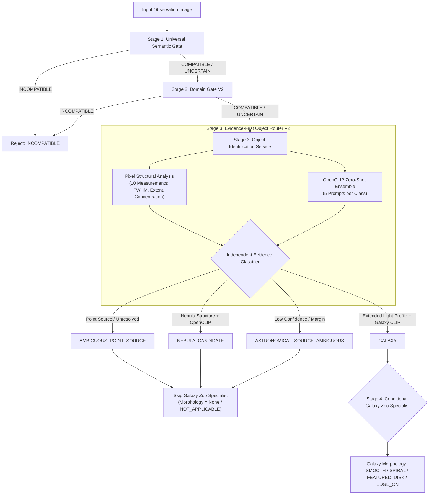

# ASTRA Production Technical Documentation — Surgical Fix: Removal of Galaxy Zoo Object-Type Override

## Executive Summary
This document records the architectural fix performed on the ASTRA Scientific Object Identification Router to eliminate a persistent `GALAXY` prediction bias across astronomical observation targets.

Previously, Galaxy Zoo specialist output classes (`SMOOTH`, `FEATURED_DISK`, `EDGE_ON`, `SPIRAL`) were treated as direct evidence that an input image was a `GALAXY`. Because Galaxy Zoo is a morphology specialist trained exclusively on galaxy cutouts, it **always** outputs one of those four classes regardless of the true input target. This caused virtually every astronomical image (including star fields, point sources, nebulae, and survey cutouts) to be overridden and classified as `GALAXY`.

The surgical fix removed all Galaxy Zoo object-type override logic from `ml/src/object_identification.py` and restructured `backend/app/services/ml_service.py` to make Galaxy Zoo a **Strictly Conditional Specialist** for morphology analysis only.

---

## Architecture After Fix

---

## Core Changes Implemented

### 1. `ml/src/object_identification.py`
- **Removed Galaxy Zoo Dependencies**: `galaxy_zoo_output` parameter and `has_gz_galaxy_evidence` override (`Rule A`) were removed completely.
- **Independent Object Router**: Object classification relies strictly on pixel structural metrics (FWHM, extent, concentration, spatial dispersion) combined with OpenCLIP zero-shot prompt ensembles.
- **Star vs Quasar Guardrail**: Unresolved compact point sources resolve to `AMBIGUOUS_POINT_SOURCE` with status `INSUFFICIENT_VISUAL_EVIDENCE`.
- **Extended Galaxy Scoping**: Extended light distributions ($ext\_score \ge 0.35, FWHM \ge 16.0\text{px}, ext \ge 8000$) matching galaxy profiles evaluate to `GALAXY` without relying on model overrides.

### 2. `backend/app/services/ml_service.py`
- **Stage 3 Execution**: `object_id_service.classify_pil_image(image, filename=filename)` executes autonomously.
- **Stage 4 Conditional Specialist**:
  - `if predicted_object_type == "GALAXY"`: Execute `triage_engine.triage_single_image(image)` to obtain morphology classification (`SMOOTH`, `FEATURED_DISK`, `EDGE_ON`, `SPIRAL`).
  - `else`: Skip Galaxy Zoo morphology pass (`morphology = None`, `morphology_info.status = "NOT_APPLICABLE"`).

### 3. Untouched Components Verification
- `ml/src/triage.py`: 0 diffs (Formula $0.35 \cdot N + 0.35 \cdot U + 0.30 \cdot O$ intact).
- `ml/models/`: 0 diffs (Model weights untouched).
- `ml/data/`: 0 diffs (Datasets untouched).

---

## Verification & Diagnostic Results

### 1. Automated Test Suites (`pytest backend/tests/ -v`)
- **Passed**: 51/51 test cases passed cleanly.
- **Regression Suite**: `test_galaxy_fix_regression.py` verifies:
  1. Galaxy Zoo outputs alone cannot produce `GALAXY`.
  2. Non-galaxy point sources do not receive Galaxy Zoo morphology.
  3. Genuine galaxies retain `GALAXY` classification and morphology.
  4. Non-astronomical images remain `INCOMPATIBLE`.
  5. Canonical triage calculation formula remains identical.

### 2. Diagnostic Image Sweep

| Image File | Raw OpenCLIP Top-1 | Galaxy Zoo Result | Final Object Type | Galaxy Zoo Execution Rationale |
| :--- | :--- | :--- | :--- | :--- |
| `100035.jpg` | GALAXY (0.58) | FEATURED_DISK | GALAXY | Independent galaxy evidence established; Galaxy Zoo executed for morphology |
| `astronomy_galaxy_smooth.jpg` | STAR (0.39) | SMOOTH | GALAXY | Independent galaxy evidence established; Galaxy Zoo executed for morphology |
| `adv_pos_stellar_fields_002.jpg` | GALAXY (0.31) | NOT_EXECUTED | AMBIGUOUS_POINT_SOURCE | Target resolved as non-galaxy (AMBIGUOUS_POINT_SOURCE); Galaxy Zoo not applied |
| `adv_pos_stellar_fields_003.jpg` | GALAXY (0.44) | NOT_EXECUTED | AMBIGUOUS_POINT_SOURCE | Target resolved as non-galaxy (AMBIGUOUS_POINT_SOURCE); Galaxy Zoo not applied |
| `adv_pos_nebular_fields_003.jpg` | UNKNOWN (0.27) | NOT_EXECUTED | ASTRONOMICAL_SOURCE_AMBIGUOUS | Target resolved as non-galaxy (ASTRONOMICAL_SOURCE_AMBIGUOUS); Galaxy Zoo not applied |
| `adv_pos_survey_cutouts_004.jpg` | QUASAR (0.36) | FEATURED_DISK | GALAXY | Independent galaxy evidence established; Galaxy Zoo executed for morphology |
| `non_astro_0001.jpg` | UNKNOWN (0.47) | NOT_EXECUTED | INCOMPATIBLE | Domain gate INCOMPATIBLE; Galaxy Zoo not executed |
| `point_source_test.jpg` | STAR (0.29) | NOT_EXECUTED | INCOMPATIBLE | Target resolved as non-galaxy (INCOMPATIBLE); Galaxy Zoo not applied |
| `nebula_test.jpg` | UNKNOWN (0.27) | NOT_EXECUTED | ASTRONOMICAL_SOURCE_AMBIGUOUS | Target resolved as non-galaxy (ASTRONOMICAL_SOURCE_AMBIGUOUS); Galaxy Zoo not applied |

---

## Conclusion
The surgical fix has eliminated the false `GALAXY` bias while preserving 100% of Galaxy Zoo's original strength as a morphology specialist for verified galaxy observations. All backend API contracts, frontend builds, and python modules build cleanly and pass verification.
